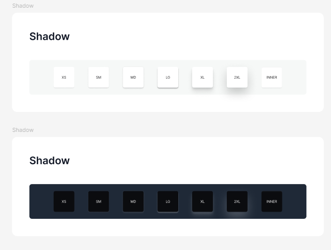

# 📘 SCSS Fondations – Design System Pecunia

## 🌟 Objectif

Mettre en place une base SCSS pour avoir des styles cohérents et faciles à maintenir dans Angular 19. On utilise des "Design Tokens" (variables globales) pour que tout soit centralisé.

---

## 📁 Arborescence SCSS

```
src/
└── styles/
    ├── styles.scss                # Entrée globale Angular
    ├── abstracts/
    │   └── _breakpoints.scss       # Mixin mq()
    │   └── _layout.scss       # Mixin padding, margin, radius, flexbox
    │   └── _shadows.scss       # Mixin sur les box-shadows
    │   └── _typography.scss       # Mixin pour appliquer les fonts

    ├── base/
    │   └── _reset.scss             # Reset CSS de base
    ├── fonts/
    │   └── _font-face.scss             # déclaration des fonts
    ├── tokens/
    │   ├── _variables-light.scss   # Thème clair
    │   ├── _variables-dark.scss    # Thème sombre
    │   ├── _variables-desktop.scss # Tailles desktop
    │   └── _variables-mobile.scss  # Tailles mobile
    └── themes/
        ├── _tokens.scss            # Fonctions `themed()` / `themed-block()`
        └── _tokens.map.scss        # Généré automatiquement (voir doc design-tokens)
```

---

## 🔧 Fichier global `styles.scss`

```scss
@use './styles/fonts/font-face' as *;
@use './styles/tokens/variables-desktop' as desktop;
@use './styles/tokens/variables-mobile' as mobile;
@use './styles/abstracts/breakpoints' as breakpoints;
@use './styles/abstracts/typography' as typo;
@use './styles/abstracts/layout' as layout;
@use './styles/abstracts/shadows' as shadows;
@use './styles/themes/tokens' as theme;
@use './styles/base/reset' as *;
```

Le fichier `styles.scss` est chargé globalement via `angular.json`.

Il contient :

- les variables light et desktop
- le reset CSS
- les mixins de breakpoints, typo, layout,...

⚠️ Les fonctions et mixins ne sont pas chargées globalement.
Elles doivent être importées localement dans chaque composant qui les utilisent:

```scss
@use '../../../styles/themes/tokens' as theme;
@use '../../../styles/abstracts/typography' as typo;
@use '../../../styles/abstracts/layout' as layout;
@use '../../../styles/abstracts/shadows' as shadows;
@use '../../../styles/abstracts/breakpoints' as breakpoints;

```

---

## 🎭 Gestion des thèmes dynamiques (light/dark)

Le thème actif est appliqué via l’attribut `data-theme` sur la balise `<html>` :

```html
<html data-theme="light">
  ou
  <html data-theme="dark"></html>
</html>
```

Un système centralisé permet de faire correspondre un token logique à la bonne valeur du thème :

```scss
// styles/themes/tokens.scss
@use 'sass:map';
@use 'tokens.map' as tokens-map;

@function themed($key, $theme-name) {
  $entry: map.get(tokens-map.$tokens, $key);
  @if $entry == null {
    @return null;
  }
  $value: map.get($entry, $theme-name);
  @if $value == null {
    @return null;
  }
  @return $value;
}

@mixin themed-block($props-map) {
  @each $theme-name in $theme-names {
    :host-context([data-theme='#{$theme-name}']) & {
      @each $prop, $token in $props-map {
        #{$prop}: themed($token, $theme-name);
      }
    }
  }
}
```

**Explication simplifiée**

- `themed($key, $theme-name)` :  
  Cette fonction va chercher la bonne valeur d'une variable (token) selon le thème (clair ou sombre).  
  Exemple : si tu demandes la couleur de fond pour le thème "dark", elle te donne la bonne couleur.

- `themed-block($props-map)` :  
  Ce mixin applique plusieurs propriétés CSS selon le thème actif.  
  Tu lui donnes une liste de propriétés et il les applique automatiquement pour chaque thème.

- On utilise `:host-context([data-theme='#{$theme-name}'])` pour que le style change tout seul quand le thème change, sans toucher au code du composant.

- Ça évite de recopier la logique de thème partout (DRY) et chaque fonction/mixin a un but précis (S de SOLID).

---

### ✅ Exemple avec un bouton

```scss
@use '../../../styles/themes/tokens' as theme;
@use '../../../styles/tokens/variables-mobile' as *;

.btn-switch {
  //style classique
  padding: 10px;
  border-radius: 8px;
  cursor: pointer;

  // application des variables issues des tokens sur les 2 thèmes
  // mixin themed-block à utiliser
  @include theme.themed-block(
    (
      background-color: 'background-primary-default',
      color: 'text-neutral-default-inverse',
    )
  );

  &:hover {
    @include theme.themed-block(
      (
        background-color: 'background-primary-hover',
      )
    );

    // 🎯 Application uniquement pour le light
    // utiliser fonction themed avec :host-context([data-theme='light'])
    :host-context([data-theme='light']) & {
      color: theme.themed('text-neutral-default', 'light');
    }
  }
}
```

---

## 🎯 Pourquoi cette organisation ?

- **Chaque fichier ou fonction a un rôle précis** (S de SOLID)
- **Tout est centralisé** : on ne répète pas les valeurs (DRY)
- **Facile à faire évoluer** : ajouter un thème ou changer une couleur est simple
- **Lisible** : tout le monde comprend où et comment utiliser les outils du design system


## ⚠️ Limite connue : propriétés CSS complexes (ex : linear-gradient)


la mixin `themed-block` remplace chaque propriété CSS du map par la valeur du token pour chaque thème.

Mais elle ne sait pas parser une fonction CSS complexe (ex: linear-gradient(...)) : elle attend un token simple.

Si tu fais ça :

 ```scss

@include theme.themed-block((
  background: linear-gradient(
    117deg,
    'background-neutral-primary' 50.11%,
    'common-neutral-low' 100%
  )
));
```

→ $token = toute la string linear-gradient(...)
→ La fonction themed() ne sait pas quoi faire de cette string qui mélange tokens et CSS.

Sass ne peut pas analyser et “remplacer” chaque nom de token à l’intérieur d’une string complexe.

Il faudrait parser la string, reconnaître les tokens, et appeler themed() sur chaque.

Il faut donc le faire à la main, c’est la limite naturelle du SCSS “classique”

→ Soit on passe par une mixin/fonction custom encore plus complexe (peu utile ici),
→ Soit on écrit le gradient manuellement pour chaque thème, comme tu as fait :

```scss
.main-wrapper {
  background: linear-gradient(
    117deg,
    #{themed('background-neutral-primary', 'light')} 50.11%,
    #{themed('common-neutral-low', 'light')} 100%
  );
}

:host-context([data-theme='dark']) .main-wrapper {
  background: linear-gradient(
    117deg,
    #{themed('background-neutral-primary', 'dark')} 50.11%,
    #{themed('common-neutral-low', 'dark')} 100%
  );
}
```

La mixin themed-block fonctionne parfaitement pour remplacer des propriétés simples (color, background-color, border-color, etc.), mais par conception, elle ne peut pas parser ni remplacer automatiquement chaque nom de token à l’intérieur d’une fonction CSS complexe comme un linear-gradient.

Dans ces cas, on utilise directement la fonction themed dans la string de gradient, pour garantir la cohérence DS, tout en restant explicite.


---
## 🔤 Gestion des polices – Open Sans

Nous utilisons **Open Sans** dans différentes variantes pour couvrir tous les styles du projet (Display, Heading, Text).

### 📦 Organisation des fichiers

les fichiers de polices sont placées dans le dossier [`src/assets/fonts`](/src/assets/fonts/)

les déclarations sont définies dans le dossier [`src/styles/fonts/_font-face.scss`](/src/styles/fonts/_font-face.scss)

Les variables typographiques (tailles, poids, interlignes) et la mixin utilitaire sont dans [`src/styles/abstracts/_typography.scss`](/src/styles/abstracts/_typography.scss)

### 🧱 Mixin typographique

```scss
@mixin text-style($size-key, $weight-key: regular, $mode: desktop) {
  $sizes: if($mode == desktop, $sizes-desktop, $sizes-mobile);

  font-family: $font-family-base;
  font-size: map.get($sizes, $size-key);
  line-height: map.get($sizes, $size-key);
  font-weight: map.get($font-weights, $weight-key);
}
```

Cette mixin permet d’appliquer une règle typographique complète (police, taille, interligne, poids) à partir de clés logiques comme `heading-h2`, `text-sm`, etc.

Le paramètre `$mode` permet de basculer dynamiquement entre mobile et desktop.  


les clés sont dans `typography.scss`


### ✅ Exemple d'utilisation d'une font
```scss

@use '../../../styles/abstracts/typography' as typo;

h2 {
  @include typo.text-style(heading-h2, extrabold, mobile);
}

``` 
Cet exemple applique :

- la police "Open Sans"
- une taille adaptée à un titre de niveau 2
- un poids fort (extrabold)
- un interligne cohérent avec la maquette

---

## 📊 Mixins et outils SCSS

### `abstracts/_breakpoints.scss`

```scss
@use 'sass:map';

$breakpoints: (
  mobile: 390px,
  tablet: 768px,
  desktop: 1024px,
);

@mixin mq($breakpoint) {
  $value: map.get($breakpoints, $breakpoint);
  @if $value {
    @media screen and (min-width: $value) {
      @content;
    }
  } @else {
    @warn "Breakpoint #{$breakpoint} non défini.";
  }
}
```

### 🔄 Exemple d’utilisation du mixin

```scss
h1 {
  font-size: 18px;

  @include mq(tablet) {
    font-size: 24px;
  }

  @include mq(desktop) {
    font-size: 32px;
  }
}
```

**Explication simplifiée**

Le mixin `mq` sert à écrire facilement des media-queries (pour adapter le style selon la taille d'écran).  
Au lieu de répéter les tailles partout, on utilise des noms comme `mobile`, `tablet`, `desktop`.  
Si on veut changer une taille, il suffit de modifier la map en haut du fichier.

Cela évite de recopier les mêmes valeurs partout (DRY) et chaque fichier a un rôle précis (S de SOLID).

---

### `abstracts/_Layout.scss`

contient les variables pour les espacement et les radius utilisables directement dans le scss

```scss
$space-2: px-to-rem(2); // 2px
$space-4: px-to-rem(4); // 4px
$space-6: px-to-rem(6); // 6px
$space-8: px-to-rem(8); // 8px
$space-10: px-to-rem(10); // 10px
$space-12: px-to-rem(12); // 12px
$space-16: px-to-rem(16); // 16px
$space-24: px-to-rem(24); // 24px
$space-32: px-to-rem(32); // 32px

  
$radius-sm: 4px;
$radius-md: 8px;
$radius-lg: 16px;
$radius-xl: 24px;
$radius-pill: 9999px;
```

la fonction `px-to-rem` permet de convertir une valeur numérique en unité `rem`

Plusieurs mixins utilitaires sont aussi présentes dans `layout` pour gérer les `margin, padding, radius et les flexbox`

#### padding et margin

```scss
@mixin  margin($top, $right: null, $bottom: null, $left: null) {
margin-top: $top;
margin-right: if($right  !=  null, $right, $top);
margin-bottom: if($bottom  !=  null, $bottom, $top);
margin-left: if($left  !=  null, $left, if($right  !=  null, $right, $top));
}

@mixin  padding($top, $right: null, $bottom: null, $left: null) {
padding-top: $top;
padding-right: if($right  !=  null, $right, $top);
padding-bottom: if($bottom  !=  null, $bottom, $top);
padding-left: if($left  !=  null, $left, if($right  !=  null, $right, $top));
}
```
Ces deux mixins simplifient l'écriture des marges et des padding dans l'application. Elles fonctionnent exactement comme les propriétés CSS  `margin`  et  `padding`, mais avec plus de flexibilité.

Les mixins acceptent de 1 à 4 paramètres, tout comme en CSS standard :

```scss
@include  margin($top, $right, $bottom, $left);
@include  padding($top, $right, $bottom, $left);
```
On peut passer e 1 à 4 valeur et les mixins s'adaptent de la façon suivante: 

1) **Un seul paramètre** (`$top`) : Appliqué aux quatre côtés

```scss
margin-top: $top;
margin-right: $top;     // Même valeur que top
margin-bottom: $top;    // Même valeur que top
margin-left: $top;      // Même valeur que top
```

2) **Deux paramètres** (`$top`, `$right`) : Vertical et horizontal

```scss
margin-top: $top;
margin-right: $right;
margin-bottom: $top;     // Même valeur que top
margin-left: $right;     // Même valeur que right
```

3) **Trois paramètres** (`$top`, `$right`, `$bottom`) : Comme CSS standard

```scss
margin-top: $top;
margin-right: $right;
margin-bottom: $bottom;
margin-left: $right;     // Même valeur que right
```

4) **Quatre paramètres** (`$top`, `$right`, `$bottom`, `$left`) : Contrôle complet

```scss
margin-top: $top;
margin-right: $right;
margin-bottom: $bottom;
margin-left: $left;
```

#####  Exemples concrets

Exemple 1 : Une valeur (même espacement partout)

```scss
.card {
  @include padding($space-8);
}

// Généré en CSS :
.card {
  padding-top: 0.5rem;
  padding-right: 0.5rem;
  padding-bottom: 0.5rem;
  padding-left: 0.5rem;
}
```

Exemple 2 : Deux valeurs (vertical/horizontal)
```scss
.button {
  @include padding($space-4, $space-8);
}

// Généré en CSS :
.button {
  padding-top: 0.25rem;     // $space-4
  padding-right: 0.5rem;    // $space-8
  padding-bottom: 0.25rem;  // $space-4
  padding-left: 0.5rem;     // $space-8
}
```

Exemple 3 : Valeurs spécifiques pour chaque côté
```scss
.header {
  @include margin($space-16, $space-8, $space-4, $space-8);
}

// Généré en CSS :
.header {
  margin-top: 1rem;       // $space-16
  margin-right: 0.5rem;   // $space-8
  margin-bottom: 0.25rem; // $space-4
  margin-left: 0.5rem;    // $space-8
}
```

Exemple 4 : Valeurs nulles pour omettre certains côtés
```scss
.section {
  @include padding($space-8, null, $space-16);
}

// Généré en CSS :
.section {
  padding-top: 0.5rem;     // $space-8
  padding-right: 0.5rem;   // $space-8 (valeur par défaut = $top)
  padding-bottom: 1rem;    // $space-16
  padding-left: 0.5rem;    // $space-8 (valeur par défaut = $right = $top)
}
```

---
#### Mixin `radius` – Guide d’utilisation

Ce mixin permet d’appliquer rapidement un `border-radius` cohérent avec le design system Pecunia, en choisissant une valeur prédéfinie.

---

## Définition SCSS

```scss
$radii: (
  sm: 4px,
  md: 8px,
  lg: 16px,
  xl: 24px,
  pill: 9999px,
);

@mixin radius($key: md) {
  $radius: map.get($radii, $key);
  @if $radius {
    border-radius: $radius;
  } @else {
    @warn "Radius `#{$key}` non trouvé dans la map $radii.";
  }
}
```

---

## Paramètres

| Paramètre | Type   | Valeurs possibles      | Défaut | Description                  |
|-----------|--------|-----------------------|--------|------------------------------|
| `$key`    | string | sm, md, lg, xl, pill  | md     | Clé du rayon à appliquer     |

---

## Valeurs disponibles

| Clé   | Valeur px | Utilisation recommandée               |
|-------|-----------|---------------------------------------|
| sm    | 4px       | Petits éléments, badges               |
| md    | 8px       | Boutons, inputs, cartes               |
| lg    | 16px      | Cartes, modales, sections             |
| xl    | 24px      | Grands conteneurs, illustrations      |
| pill  | 9999px    | Effet "pilule" (boutons ronds)        |

---

## Exemples d’utilisation

```scss
// Bord arrondi moyen (par défaut)
.card {
  @include radius();
}

// Bord arrondi large
.modal {
  @include radius(lg);
}

// Effet pilule (pour un bouton rond)
.button-pill {
  @include radius(pill);
}
```

---

#### Flexbox

Les  mixins `flex` et `flex-center` sont là pour simplifier ton code tout en gardant toute la puissance de flexbox.

La mixin `flex-center`est un raccourci pour un élément horizontalement et verticalement. C'est l'une des opérations les plus courantes en CSS. 

```scss
@mixin  flex-center {
display: flex;
justify-content: center;
align-items: center;
}
```
##### Exemple d'utilisation

```scss
.content {
@include  flex-center;
height: 100vh; // Hauteur de l'écran complet
}
```

La mixin `flex`

C'est un mixin flexible qui permet de configurer n'importe quelle propriété flexbox. On peut spécifier une seule ou toutes les propriétés.

```scss
@mixin  flex(
$dir: null,
$wrap: null,
$justify: null,
$align: null,
$gap: null
) {

display: flex;

@if  $dir  !=  null {
flex-direction: $dir;
}
@if  $wrap  !=  null {
flex-wrap: $wrap;
}
@if  $justify  !=  null {
justify-content: $justify;
}
@if  $align  !=  null {
align-items: $align;
}
@if  $gap  !=  null {
gap: $gap;
}
}
```
 Les paramètres en détail

- **$dir** : Direction des éléments
  - `row` (défaut) : éléments alignés horizontalement
  - `column` : éléments alignés verticalement
  - `row-reverse`, `column-reverse` : ordre inversé

- **$wrap** : Comment les éléments se comportent quand il n'y a plus de place
  - `nowrap` (défaut) : reste sur une seule ligne, peut déborder
  - `wrap` : passe à la ligne suivante si besoin
  - `wrap-reverse` : passe à la ligne du bas vers le haut

- **$justify** : Alignement horizontal (sur l'axe principal)
  - `flex-start` (défaut) : éléments au début
  - `center` : éléments au centre
  - `flex-end` : éléments à la fin
  - `space-between` : espacés avec les extrémités collées aux bords
  - `space-around` : espacés avec espace autour de chaque élément
  - `space-evenly` : espacés uniformément

- **$align** : Alignement vertical (sur l'axe secondaire)
  - `stretch` (défaut) : étirés pour occuper tout l'espace
  - `center` : centrés
  - `flex-start` : en haut/au début
  - `flex-end` : en bas/à la fin
  - `baseline` : alignés sur la ligne de base du texte

- **$gap** : Espace entre les éléments (utilise les variables `$space-*`)
  - Exemple: `$space-8` pour 8px d'espacement

1. Une barre de navigation horizontale avec espace entre les éléments

```scss
.navbar {
  @include flex($justify: space-between, $align: center);
  padding: $space-4 $space-8;
}
```

2. Une liste verticale d'éléments espacés

```scss
.menu-items {
  @include flex($dir: column, $gap: $space-8);
}
```

3. Une grille d'images qui se réorganise automatiquement

```scss
.image-gallery {
  @include flex($wrap: wrap, $gap: $space-16, $justify: center);
}
```

4. Un formulaire avec labels et champs alignés

```scss
.form-group {
  @include flex($dir: column, $gap: $space-4);
  
  @include mq(tablet) {
    // Change en horizontal sur tablette et +
    @include flex($dir: row, $align: center, $gap: $space-8);
  }
}
```

L'avantage du  `null`

En utilisant  `null`  comme valeur par défaut, on peut spécifier  **uniquement les propriétés dont on a besoin**. Les propriétés non spécifiées n'apparaîtront pas dans le CSS final, ce qui donne un code plus léger.

```scss
// Seulement direction et gap
.sidebar {
  @include flex($dir: column, $gap: $space-16);
}

// Génère seulement :
.sidebar {
  display: flex;
  flex-direction: column;
  gap: 1rem;
}
```
---

### `abstracts/_shadows.scss`

le fichier gère le système des ombres

***Il reprend les éléments du DS sous figma***



```scss
@use 'sass:map';

$shadows: (
  light: (
    xs: (0px 1px 2px rgba(9, 9, 11, 0.05)),
    sm: (0px 1px 3px rgba(9, 9, 11, 0.10), 0px 1px 2px rgba(9, 9, 11, 0.10)),
    md: (0px 4px 6px rgba(9, 9, 11, 0.10), 0px 0px 4px rgba(9, 9, 11, 0.10)),
    lg: (0px 4px 6px rgba(9, 9, 11, 0.10), 0px 4px 4px rgba(9, 9, 11, 0.20)),
    xl: (0px 20px 25px rgba(9, 9, 11, 0.10), 0px 8px 10px rgba(9, 9, 11, 0.10)),
    2xl: (0px 25px 50px rgba(9, 9, 11, 0.20)),
    inner: (inset 0px 2px 4px 0px rgba(9, 9, 11, 0.05))
  ),
  dark: (
    xs: (0px 1px 2px rgba(255, 255, 255, 0.05)),
    sm: (0px 1px 3px rgba(255, 255, 255, 0.10), 0px 1px 2px rgba(255, 255, 255, 0.10)),
    md: (0px 4px 6px rgba(255, 255, 255, 0.10), 0px 0px 4px rgba(255, 255, 255, 0.10)),
    lg: (0px 4px 6px rgba(255, 255, 255, 0.10), 0px 4px 4px rgba(255, 255, 255, 0.20)),
    xl: (0px 20px 25px rgba(255, 255, 255, 0.10), 0px 8px 10px rgba(255, 255, 255, 0.10)),
    2xl: (0px 25px 50px rgba(255, 255, 255, 0.20)),
    inner: (inset 0px 2px 4px 0px rgba(255, 255, 255, 0.05))
  )
);

@mixin shadow($key, $theme: light) {
  $theme-map: map.get($shadows, $theme);
  $shadow: map.get($theme-map, $key);

  @if $shadow {
    box-shadow: $shadow;
  } @else {
    @warn "Shadow `#{$key}` not found for theme `#{$theme}`.";
  }
}
```
#### La map `$shadows`

C'est une structure de données organisée en trois niveaux:
1. **Premier niveau**: Les thèmes (`light` et `dark`)
2. **Deuxième niveau**: Les tailles d'ombre (`xs`, `sm`, `md`, `lg`, `xl`, `2xl`, `inner`)
3. **Troisième niveau**: Les valeurs d'ombres CSS (entre parenthèses)


#### Le mixin `shadow`

C'est une fonction réutilisable qui:
1. Prend deux paramètres: 
   - `$key`: La taille de l'ombre (`xs`, `sm`, `md`, etc.)
   - `$theme`: Le thème à utiliser (`light` ou `dark`, avec `light` par défaut)
2. Récupère la bonne valeur d'ombre depuis la structure imbriquée
3. L'applique comme `box-shadow` si elle existe
4. Affiche un avertissement si l'ombre demandée n'existe pas

#### Exemple de base

```scss
.card {
  // Ombre légère (sm) en thème clair (par défaut)
  @include shadow(sm);
}
```

#### Exemple avec thème spécifique

```scss
.card-dark {
  // Ombre moyenne (md) en thème sombre
  @include shadow(md, dark);
}
```

#### Exemple avec adaptation au thème actif

```scss
// Pour un élément qui s'adapte au thème de l'application
.adaptive-card {
  // Style de base
  background-color: white;
  
  // En thème clair
  :host-context([data-theme='light']) & {
    @include shadow(md, light);
  }
  
  // En thème sombre
  :host-context([data-theme='dark']) & {
    background-color: #333;
    @include shadow(md, dark);
  }
}
```

---

exemple dans le bouton switch du theme avec  les mixins theme, layout, typo et shadows

***Pensez bien aux imports ***

```scss
@use  '../../../styles/themes/tokens'  as  theme;
@use  '../../../styles/abstracts/typography'  as  typo;
@use  '../../../styles/abstracts/layout'  as  layout;
@use  '../../../styles/abstracts/shadows'  as  shadows;

.btn-switch {

// Utilisation des variables de thème

  @include layout.flex($dir: row, $align: center, $justify: space-between, $gap : space-8);
  @include layout.padding(space-8, space-12);
  @include layout.margin(space-8, space-12);
  @include layout.radius(md);
  @include shadows.shadow(lg, dark);
  border: none;
  cursor: pointer;
  font-family: 'open-sans', sans-serif;

  @include typo.text-style(text-md, regular);

  //style identique pour les deux thèmes
  @include theme.themed-block(
    (
      background-color: 'background-primary-default',
      color: 'text-neutral-default-inverse',
    )
  );

  // hover séparé
  &:hover {
    @include theme.themed-block(
      (
        background-color: 'background-primary-hover',
      )
    );
  }
}

// 🎯 Exception uniquement pour le light
:host-context([data-theme='light']) .btn-switch {
  @include shadows.shadow(lg, light);
  &:hover {
    color: #{theme.themed('text-neutral-default', 'light')};
  }
}
```